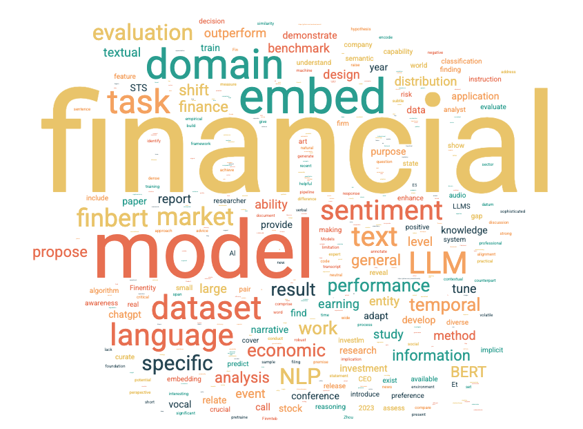

The FinNLP Group, led by [Prof. Yi Yang](https://yya518.github.io/), pioneers NLP and machine learning innovations tailored for financial and business applications. Our research is problem-driven and impact-focused, addressing real-world challenges in financial services.

We bridge academic rigor with industry relevance, collaborating closely with [industry partners](/industry) to validate ideas and build practical prototypes. Our goal is to push the frontier of AI in finance, ensuring that our research not only advances the field but also delivers tangible value to the industry.

# Research Focus Areas

    <h3>01. Financial Text Embedding</h3>
    <i class="expand-icon fas fa-chevron-down"></i>

  

Financial text embedding models, which transform unstructured financial text into dense numerical representations (embeddings), are essential for financial AI applications. Compared to general-purpose text embedding models that encode all textual information, financial text embedding models should prioritize extracting essential financial insights while filtering out irrelevant noise, thereby enhancing representation capability and accuracy.

Our group is developing financial text embedding models and benchmarks, with two primary use cases:

**Alternative Data for Quantitative Research:**  
Financial text embeddings enable hedge funds and quantitative traders to incorporate alternative data sources—such as annual reports, financial news, and earnings call transcripts—into their quantitative models. By converting text data into embeddings and integrating them with traditional market factors, researchers can develop predictive models that leverage alternative data to generate alpha.

**Financial Information Retrieval:**  
Financial text embeddings enhance retrieval accuracy in financial reports, regulatory filings, and news articles. They enable AI-driven assistants to provide more precise and contextually relevant responses, particularly in retrieval-augmented generation (RAG) systems. This improves question-answering, document retrieval, and overall financial service quality for banks, insurance companies, and wealth management firms.

**⭐ FinMTEB:**[^1] A large-scale financial text embedding benchmark designed for retrieval and classification in finance and business contexts. It comprises 64 financial domain-specific embedding datasets across 7 tasks that cover diverse textual types in both Chinese and English, such as financial news articles, corporate annual reports, ESG reports, regulatory filings, and earnings call transcripts.  Explore the [FinMTEB leaderboard](https://huggingface.co/FinanceMTEB).  

**⭐ FinE5:**[^1] A financial text embedding model that achieves top performance on the FinMTEB benchmark. It is adapted from [E5-Mistral](https://huggingface.co/intfloat/e5-mistral-7b-instruct), using a persona-based data synthetic method to cover diverse financial embedding tasks for post-training, without relying on supervised tasks. Explore the [FinE5 model](https://huggingface.co/FinanceMTEB/Fin-e5).

 

**📄 Publication:**  

[^1]: Tang, Yixuan, and Yi Yang. "[FinMTEB: Finance Massive Text Embedding Benchmark](https://arxiv.org/abs/2502.10990)." arXiv preprint arXiv:2502.10990 (2025).  


  {{ embed_content | markdownify }}

    <h3>02. Domain-specific LLM for Finance, Investment and Banking</h3>
    <i class="expand-icon fas fa-chevron-down"></i>

     

The financial industry has a unique linguistic landscape that differs significantly from general-purpose language use. For instance, the word *"liability"* carries a neutral connotation in finance and business, whereas in everyday language, it often implies something negative. This distinction highlights a fundamental challenge:  
**How can we adapt general-purpose language models to the financial and investment sectors to achieve both greater efficiency (smaller model size) and higher accuracy compared to generic LLMs?**  

Our research group has a strong track record of developing domain-specific language models optimized for the nuances of financial communication. From the early BERT era to today’s advanced generative AI, we continue to push the boundaries of financial NLP.  

**⭐ InvestLM:**[^1] A large langage model (LLM) post-trained specifically for financial and investment-related generative AI applications. It delivers performance on financial NLP tasks comparable to leading commercial LLMs, such as GPT-4o.

**The Hong Kong Monetary Authority (HKMA)** has publicly [welcomed the launch of InvestLM](https://www.hkma.gov.hk/eng/news-and-media/press-releases/2024/11/20241128-4/) as part of its broader initiative to empower Hong Kong’s financial services industry—particularly small-to-medium financial institutions—in harnessing the full potential of GenAI technologies.

**⭐ FinBERT:**[^2] A financial domain-specific language model built on Google’s BERT architecture. It is pre-trained on approximately 5 billion tokens of financial communication text, including SEC Reports (10-K & 10-Q), earnings call transcripts, and analyst reports.

FinBERT and its fine-tuned versions for [financial sentiment analysis], [ESG classification], and [forward-looking analysis] are publicly available on HuggingFace. Among them, FinBERT-tone is one of the most downloaded sentiment models on HuggingFace and has been used by quantitative firms to extract market sentiment signals.

**⭐ BankingMeTaLM:**[^3] is a Mixture-of-Experts (MoE) Tabular Language Model developed in collaboration with **WeBank**. It is designed to tackle core banking industry challenges, including: enterprise credit risk Assessment, enterprise profit forecasting, and enterprise loan default prediction.  

   
  
**📄 Publication:**  

[^1]: Yang, Yi, Yixuan Tang, and Kar Yan Tam. [Investlm: A large language model for investment using financial domain instruction tuning.](https://arxiv.org/abs/2309.13064) arXiv preprint arXiv:2309.13064 (2023).

[^2]: Huang, Allen H., Hui Wang, and Yi Yang. [FinBERT: A large language model for extracting information from financial text.](https://onlinelibrary.wiley.com/doi/full/10.1111/1911-3846.12832) Contemporary Accounting Research 40, no. 2 (2023): 806-841.

[^3]: Guo, Yue, Wentao Zhang, Xiaojun Zhang, Vincent W. Zheng, and Yi Yang. 2025. Efficient Multi-Expert Tabular Language Model for Banking. In Proceedings of the SIGKDD Conference on Knowledge Discovery and Data Mining – Applied Data Science Track (KDD).



{{ embed_content | markdownify }}

    <h3>03. NLP/ML for Financial Applications</h3>
    <i class="expand-icon fas fa-chevron-down"></i>


Our group develops and benchmarks NLP and machine learning models for various financial applications involving text data.  

**⭐ Evaluation:** We are interested in benchmarking LLMs' capabilities on tasks beyond generic NLU, such as economic reasoning[^1], economic risk preference [^2], and financial NLU [^3]. We have also observed that pretrained LLMs exhibit implicit preference biases, such as favoring Tesla over Ford [^4].  

**⭐ Market Risk Forecasting:** We focus on extracting key information from financial disclosures, including annual reports and earnings conference calls, to forecast a firm's stock market risks. Additionally, we developed one of the first multimodal stock market risk forecasting models that integrates both managers' vocal and verbal cues [^5].  

**⭐ Financial Text Similarity:** How similar are two financial texts? We are deeply interested in measuring textual similarity in the financial domain. As [Lazy Prices](https://onlinelibrary.wiley.com/doi/abs/10.1111/jofi.12885) suggests, the textual similarity between a company's quarterly reports serves as a strong text factor for predicting future abnormal returns. In response, we have proposed a deep learning method, **FinSTS**, to capture nuanced differences between financial texts [^6].  

**⭐ Financial Sentiment Analysis:** The accuracy of financial sentiment analysis models deteriorates under market regime shifts. To address this, we propose a robust NLP model that combines out-of-distribution detection with time-series modeling for temporal financial sentiment analysis [^7]. We have also collaborated with HKMA to develop **FinEntity**, an entity-level financial sentiment model [^8].  

**📄 Publication:**  

[^1]: Guo, Yue, and Yi Yang. [EconNLI: Evaluating Large Language Models on Economics Reasoning.](https://aclanthology.org/2024.findings-acl.58/) In Findings of the Association for Computational Linguistics ACL 2024, pp. 982-994. 2024.

[^2]: Liu, Jiaxin, Yi Yang, and Kar Yan Tam. 2025. Evaluating and Aligning Human Economic Risk Preferences in LLMs.

[^3]: Guo, Yue, Zian Xu, and Yi Yang. [Is ChatGPT a Financial Expert? Evaluating Language Models on Financial Natural Language Processing.](https://aclanthology.org/2023.findings-emnlp.58/) In Findings of the Association for Computational Linguistics: EMNLP 2023, pp. 815-821. 2023.

[^4]: Chuang, Chengyu, and Yi Yang. [Buy tesla, sell ford: Assessing implicit stock market preference in pre-trained language models.](https://aclanthology.org/2022.acl-short.12/) In Proceedings of the 60th Annual Meeting of the Association for Computational Linguistics (Volume 2: Short Papers), pp. 100-105. 2022.

[^5]: Qin, Yu, and Yi Yang. [What you say and how you say it matters: Predicting stock volatility using verbal and vocal cues.](https://aclanthology.org/P19-1038/) In Proceedings of the 57th Annual Meeting of the Association for Computational Linguistics, pp. 390-401. 2019.

[^6]: Liu, Jiaxin, Yi Yang, and Kar Yan Tam. [Beyond Surface Similarity: Detecting Subtle Semantic Shifts in Financial Narratives.](https://aclanthology.org/2024.findings-naacl.168/) In Findings of the Association for Computational Linguistics: NAACL 2024, pp. 2641-2652. 2024.

[^7]: Guo, Yue, Chenxi Hu, and Yi Yang. [Predict the Future from the Past? On the Temporal Data Distribution Shift in Financial Sentiment Classifications.](https://aclanthology.org/2023.emnlp-main.65/) In The 2023 Conference on Empirical Methods in Natural Language Processing.

[^8]: Tang, Yixuan, Yi Yang, Allen H. Huang, Andy Tam, and Justin Z. Tang. [FinEntity: Entity-level Sentiment Classification for Financial Texts.](https://aclanthology.org/2023.emnlp-main.956/) In The 2023 Conference on Empirical Methods in Natural Language Processing. 



{{ embed_content | markdownify }}

  
  
Generated from publication abstracts.

